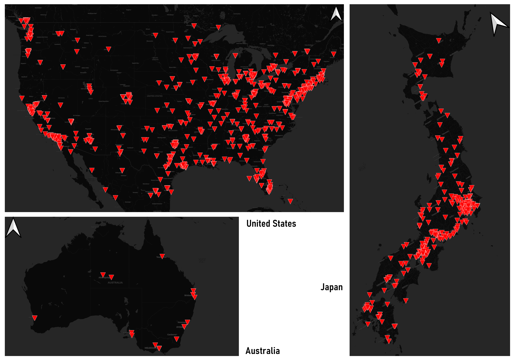

# Mapping Tweets in the US, Australia, and Japan

The following map represents the tweets collected in a two-minute long period on a Saturday (01.23.2021) night circa 8:00-9:00 pm using a Tweet crawler capturing geolocated Tweets in several areas around the world.

Each red triangle on the map represents a single tweet sent out from that location with a geolocating tag attached to it. Looking at the distribution of tweets in the US and Japan it is easy to see that it reflects population patterns and distribution across the US. Furthermore, in terms of relative time, the distribution represents Twitter use in the US at night with the East coast nearing midnight at the time of collection. Meanwhile Japan and Australia are representative of Twitter use around mid-afternoon. These maps are also not solely indications of population distributions either. It would be wrong to assume that no tweets are being made in areas without red triangles, nor should we assume that people in those places have Twitter accounts. There are a number of factors at play here including the digital divide with differing levels of technological adoption and the willingness to geotag tweets with users' locations. It is entirely possible that Australia is tweeting as frequently as US habitants but are more hesitant to broadcast their location. 
